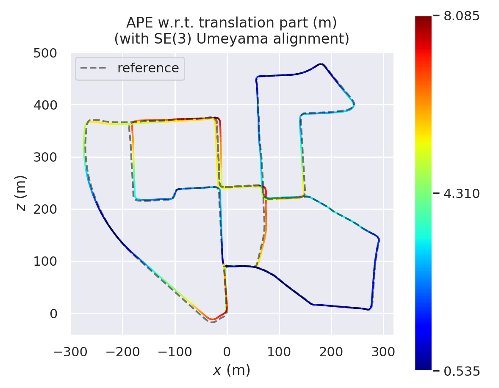
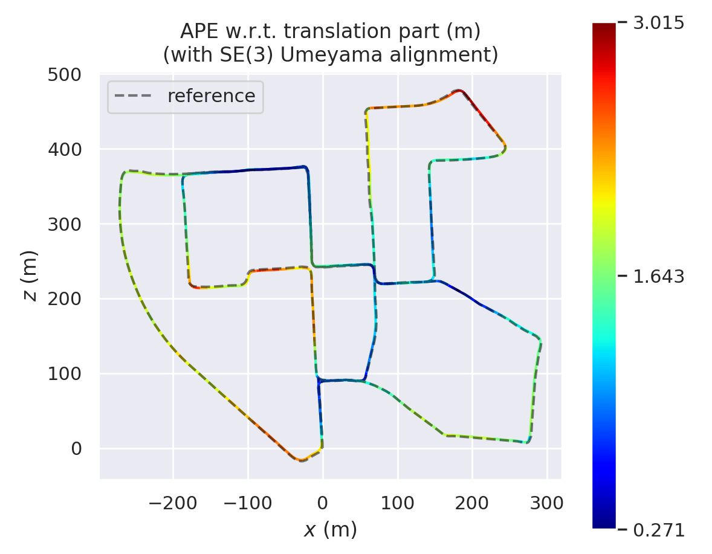

# Simple Stero Visual Inertial SLAM(SSVIO)

<div align="center">

[English](README.md) | [简体中文](doc/Chinese.md)

</div>

A lightweight setero visual-inertial SLAM system implementation, including complete closed-loop detection, front-end tracking, back-end optimization, visualization and other parts. This warehouse is more friendly to students who are new to SLAM. At the same time, the performance of this system is evaluated on the Kitti dataset. Although there is still a certain distance from the SOTA method, it is basically a usable visual odometry system.You can see a more detailed running effect of the entire project on [bilibili](https://www.bilibili.com/video/BV1em4y1n72a/?vd_source=52d31820d2ae9aaeb76f66215b74401e).

<div align=center></div>

## Install 🛠️

- Opencv3.2 needs to be installed in advance, of course, its 3.x version should also be applicable. 
- At the same time we use Pangolin0.6 for visualization.

```shell
sudo apt install libgoogle-glogdev libeigen-dev libsuitesparse-dev libcholmod3
cd thirdparty/g2o
mkdir build
cmake ..
make -j

cd ../DBoW2
mkdir build
cd build
cmake ..
make -j
```

- Next compile our project

```shell
mkdir build && cd build
cmake ..
make -j
```

## Running SSVIO 🏃

You need to pass in two parameters via the command line according to the glog, the example as follow

```shell
../bin/test_system \
--config_yaml_path=/home/xxx/ssvio/config/kitti_00.yaml \
--kitti_dataset_path=/home/xxx/kitti/dataset/sequences/00
```

## System Result On [Kitti Dataset](https://www.cvlibs.net/datasets/kitti/user_register.php)🏋️

We verified the SLAM algorithm in this warehouse on the Kitti dataset, and compared the results with and without loop closure, the evaluate tool is [evo tool](https://github.com/MichaelGrupp/evo) ,as shown below.

<table>
    <tr>
        <td><center></center><center>Without Loop On Kitti 00 Seq</center></td>
        <td><center></center><center>With Loop On Kitti 00 Seq</center></td>
    </tr>
</table>


## Citation 📝

- [Visual SLAM14 Lecture](https://github.com/gaoxiang12/slambook2)
- [A Simple Stereo SLAM System with Deep Loop Closing](https://github.com/Mingrui-Yu/A-Simple-Stereo-SLAM-System-with-Deep-Loop-Closing)
- [ORB-SLAM2](https://github.com/raulmur/ORB_SLAM2)
- [SAD Book](https://github.com/gaoxiang12/slam_in_autonomous_driving)

## TODO📜

- [ ] Update Pangolin UI
- [ ] Add IMU to backend opt
- [ ] Embed [LightGlue](https://github.com/cvg/LightGlue) into the front end