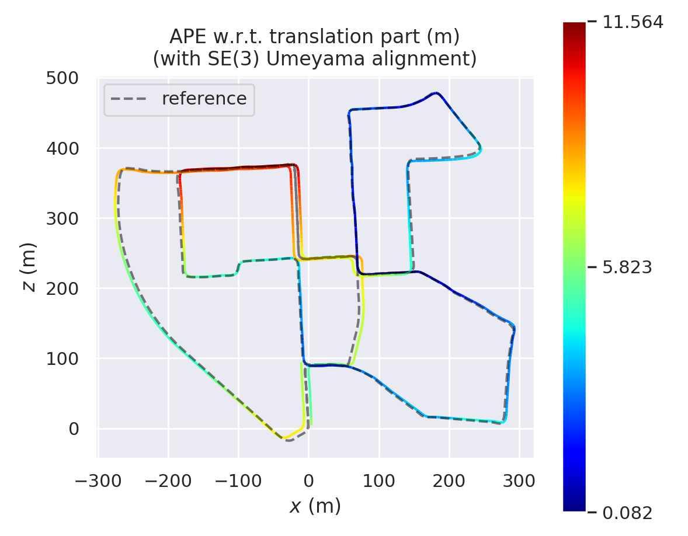
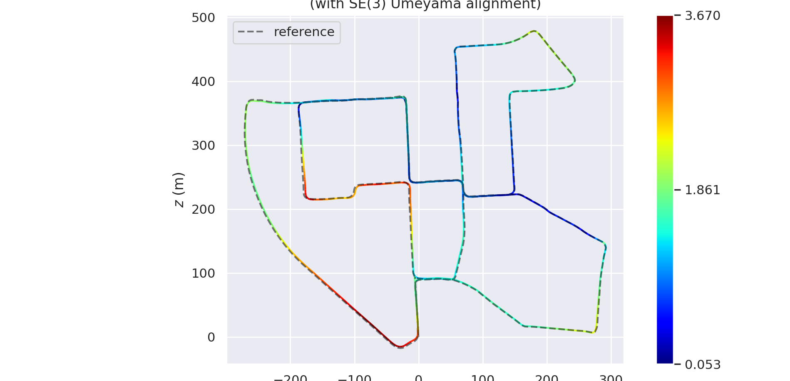

# Simple Stero Visual Inertial SLAM(SSVIO)
### [[English](https://github.com/weihaoysgs/ssvio)|[Chinese](https://github.com/weihaoysgs/ssvio/blob/master/doc/Chinese.md)]
The realization of a lightweight setero visual inertial SLAM system, including complete loop closure detection, front-end tracking, back-end optimization, visualization and other parts. This warehouse is more friendly to students who are new to SLAM.At the same time, the [evo tool](https://github.com/MichaelGrupp/evo) is used to evaluate the output results of this system. Although there is still a certain distance from the SOTA method, it is basically a usable visual odometry system.

## System Result On [Kitti Dataset](https://www.cvlibs.net/datasets/kitti/user_register.php)

- With closed no loop detection

- With closed loop detection

